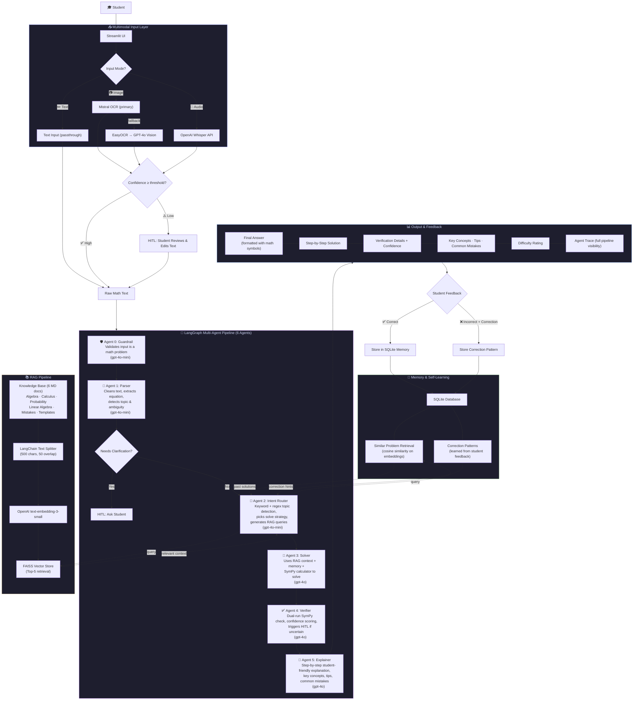

# Math Mentor - AI-Powered JEE Math Tutor

A multimodal AI application that solves JEE-style math problems using **GPT-4o**, **LangGraph** multi-agent orchestration, **LangChain + FAISS** RAG, human-in-the-loop verification, and **SQLite**-backed memory.

## Architecture



## Core Stack

| Layer | Tool | Why |
|-------|------|-----|
| LLM | GPT-4o + GPT-4o-mini | Heavy agents (Solver, Verifier, Explainer) use GPT-4o; lightweight agents (Guardrail, Parser, Router) use GPT-4o-mini for speed |
| OCR | Mistral OCR (primary) + EasyOCR + GPT-4o Vision (fallbacks) | Best math OCR accuracy with multi-engine fallback |
| Agent Framework | LangGraph | Typed state, conditional routing, HITL support, agent trace |
| RAG | LangChain + FAISS | Fast similarity search, no infra needed |
| Embeddings | text-embedding-3-small | Cheap, fast, OpenAI-native |
| SymPy | SymPy Calculator | Dual-run symbolic verification of solutions |
| Audio (ASR) | OpenAI Whisper API (gpt-4o-transcribe) | One-liner, math-aware transcription |
| UI | Streamlit | Dark-themed dashboard with topic cards, memory stats, agent trace |
| Memory | SQLite + OpenAI Embeddings | Similar problem retrieval, correction pattern learning, survives restarts |
| Deployment | Streamlit Cloud | Free, instant, reviewer gets a live link |

## Features

- **Multimodal Input**: Text, Image (GPT-4o Vision), Audio (Whisper API)
- **5 LangGraph Agents**: Parser, Intent Router, Solver, Verifier, Explainer
- **RAG Pipeline**: LangChain text splitter + FAISS + OpenAI embeddings
- **Human-in-the-Loop**: Triggers on low confidence, ambiguity, verification failures
- **Memory & Self-Learning**: SQLite-backed store; retrieves similar problems, learns from corrections
- **Agent Trace**: Full visibility into each agent's output
- **Confidence Indicators**: Visual confidence scores throughout

## Supported Topics

- Algebra (equations, identities, sequences, inequalities)
- Probability (counting, distributions, Bayes' theorem)
- Calculus (limits, derivatives, optimization)
- Linear Algebra (matrices, determinants, vectors, eigenvalues)

## Setup & Run

### Prerequisites

- Python 3.9+
- OpenAI API Key (GPT-4o access)

### Installation

```bash
git clone <repo-url>
cd ai-math

python -m venv venv
source venv/bin/activate  # Windows: venv\Scripts\activate

pip install -r requirements.txt

cp .env.example .env
# Add your OPENAI_API_KEY to .env
```

### Run

```bash
streamlit run app.py
```

Opens at `http://localhost:8501`.

## Project Structure

```
ai-math/
├── app.py                  # Streamlit UI
├── agents.py               # LangGraph multi-agent pipeline (5 agents)
├── rag_pipeline.py         # LangChain + FAISS RAG
├── memory_layer.py         # SQLite memory store
├── input_handlers.py       # GPT-4o Vision + Whisper API
├── config.py               # Configuration
├── requirements.txt        # Dependencies
├── .env.example            # Environment template
├── knowledge_base/         # Curated math knowledge (6 docs)
│   ├── algebra_formulas.md
│   ├── probability_formulas.md
│   ├── calculus_formulas.md
│   ├── linear_algebra_formulas.md
│   ├── common_mistakes.md
│   └── solution_templates.md
├── memory_store/           # SQLite DB (auto-created)
└── vector_store/           # FAISS index (auto-created)
```

## How It Works

1. **Input** - Student provides a math problem via text, image, or audio
2. **Extraction** - GPT-4o Vision (images) or Whisper API (audio) extracts text; user can edit (HITL)
3. **LangGraph Pipeline** runs 5 agents sequentially with typed state:
   - **Parser** - Cleans input, identifies topic, detects ambiguity
   - **Intent Router** - Selects strategy, generates RAG queries
   - **Solver** - Uses RAG context + memory + SymPy to solve
   - **Verifier** - Checks correctness, triggers HITL if unsure
   - **Explainer** - Creates student-friendly step-by-step explanation
4. **Feedback** - Student marks correct/incorrect; corrections stored in SQLite for future learning

## UI Screenshots

### Home Page — Text Input & Solution
The main interface features a dark-themed dashboard with topic selection, memory stats, pipeline trace, and a clean input area supporting Text, Image, and Audio modes.

.png)

### Step-by-Step Solution & Verification
After solving, the app displays a detailed step-by-step solution with confidence score, verification status, difficulty rating, and agent trace.

.png)

### Verification, Common Mistakes & Input Corrections
The verifier agent checks correctness independently. Common mistakes and input corrections are highlighted to help students learn.

.png)

### Difficulty Rating, Key Concepts & Feedback
Each solution ends with a difficulty rating, key concepts, tips, common mistakes summary, and a feedback section for self-learning.

.png)

---

## Example Solution — Image Input (Linear Algebra)

End-to-end walkthrough of solving `Find det([[-4,-2],[5,4]])` from an uploaded image.

### 1. Image Upload & OCR Extraction
A math problem image is uploaded. Mistral OCR extracts the text with 95% confidence. The student can edit the extracted text before solving (HITL).

.png)

### 2. Final Answer & Agent Trace
The solver returns the final answer (`-6`) with a full step-by-step explanation. The Agent Trace panel shows each agent's status (Guardrail, Parser, Router, Solver, Verifier, Explainer). Retrieved RAG context is displayed alongside.

.png)

### 3. Solution Steps, SymPy Verification & Confidence
Detailed arithmetic steps are shown. SymPy solver independently verifies the result. Retrieved context from the knowledge base and overall confidence score are visible.

.png)

### 4. Key Concepts, Tips & Verification Details
Key concepts, tips for similar problems, and common mistakes are listed. The verification panel confirms correctness with a detailed checklist.

.png)

### 5. Difficulty, Expandable Details & Feedback
Difficulty rating, expandable sections (Parsed Problem, Solution Raw, Verification, Routing Strategy), and Correct/Incorrect feedback buttons for self-learning.

.png)

---

## Deployment (Streamlit Cloud)

1. Push to GitHub
2. Go to [share.streamlit.io](https://share.streamlit.io)
3. Connect repo, set `app.py` as main file
4. Add `OPENAI_API_KEY` in Secrets
5. Deploy - reviewer gets a live link
